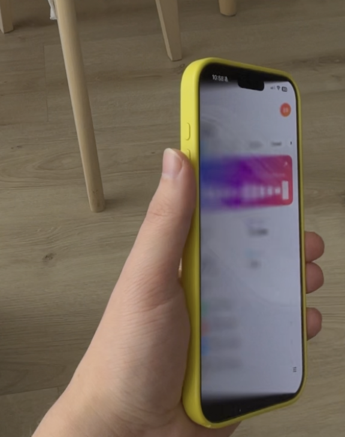

# DuoLikeAnimation

An iOS demo project that mimics the folding animation of the iPhone Duo using nothing but SwiftUI
shaders and Core Motion. It shows how a Metal `layerEffect` fed with live device attitude can make a
flat phone behave like one half of a folding device.

The effect turns the iPhone into a pane of frosted glass. Tilt the phone around its vertical axis and
the interface stays where it was in space, while the screen renders what you would see through a
tilted, slightly cloudy window: reprojected by perspective, blurred and dimmed in proportion to how
far the glass has moved away from the interface, and black wherever a ray misses the interface
entirely.

<p align="center">
  
</p>

## The model

- The interface lives on a fixed plane in the world: the plane the screen occupied at zero tilt.
- The viewer does not move. Their eye stays on that plane's normal through the screen center, at a
  hand-held viewing distance (320 mm by default).
- When the device tilts, the screen rotates around the edge that is farther from the viewer. That
  edge stays in the interface plane; the rest of the glass rises toward the eye.
- For every pixel the shader casts a ray from the eye through its position on the rotated glass and
  continues it to the interface plane. It samples the interface there with a disk blur whose radius
  grows with the gap between glass and plane, and dims the result by the same measure.

## Layout

| File | Role |
| --- | --- |
| `DuoLikeAnimation/Shaders/DuoFold.metal` | The `layerEffect` shader: reprojection, blur, darkening. |
| `DuoLikeAnimation/FoldEffect.swift` | `.foldEffect(angle:parameters:)` and the tunables in `FoldParameters`. |
| `DuoLikeAnimation/FoldMotionModel.swift` | Core Motion: calibrated zero pose, tilt around the screen's Y axis, gyro prediction. |
| `DuoLikeAnimation/DemoContentView.swift` | The interface being looked at. |
| `DuoLikeAnimation/ContentView.swift` | Composition plus a floating panel for recalibration and manual tilt. |

## Running it

Open `DuoLikeAnimation.xcodeproj` and run on a device. The first motion sample becomes the zero-tilt
pose; the panel in the bottom-right corner lets you recalibrate or switch to a manual tilt slider.

On the simulator there is no motion data, so manual mode is on by default. A launch-time tilt can be
passed for screenshots:

```sh
SIMCTL_CHILD_TILT_DEGREES=-20 xcrun simctl launch booted io.elijahsemyonov.DuoLikeAnimation
```

## Notes

- Everything under the effect must be pure SwiftUI. UIKit-backed views such as `ScrollView` are not
  rasterized into a shader layer, and the subtree has to be flattened with a compositing group first,
  otherwise SwiftUI shades every leaf view on its own transparent layer.
- The Core Motion rotation matrix convention is resolved at runtime against the gravity vector, so
  the hinge lands on the correct side without depending on documentation.

## Credits

Built with [Claude Code](https://claude.com/claude-code) using Claude Fable 5.1.

## License

MIT, see [LICENSE](LICENSE).
